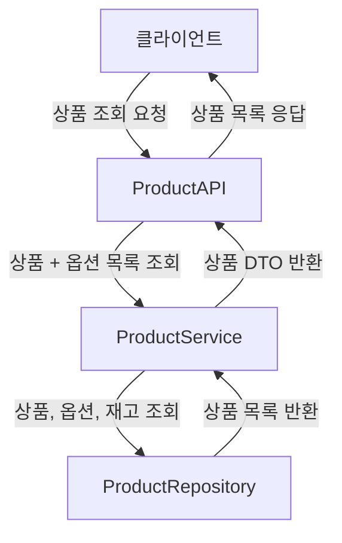
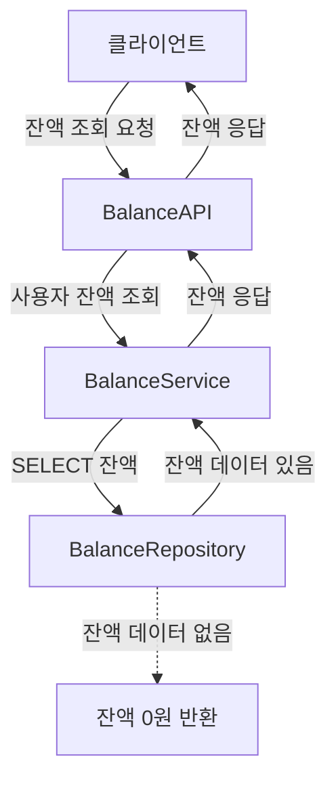
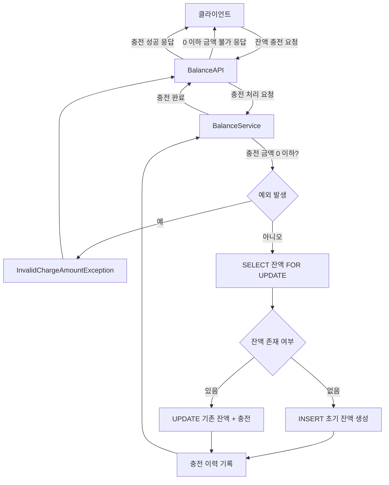
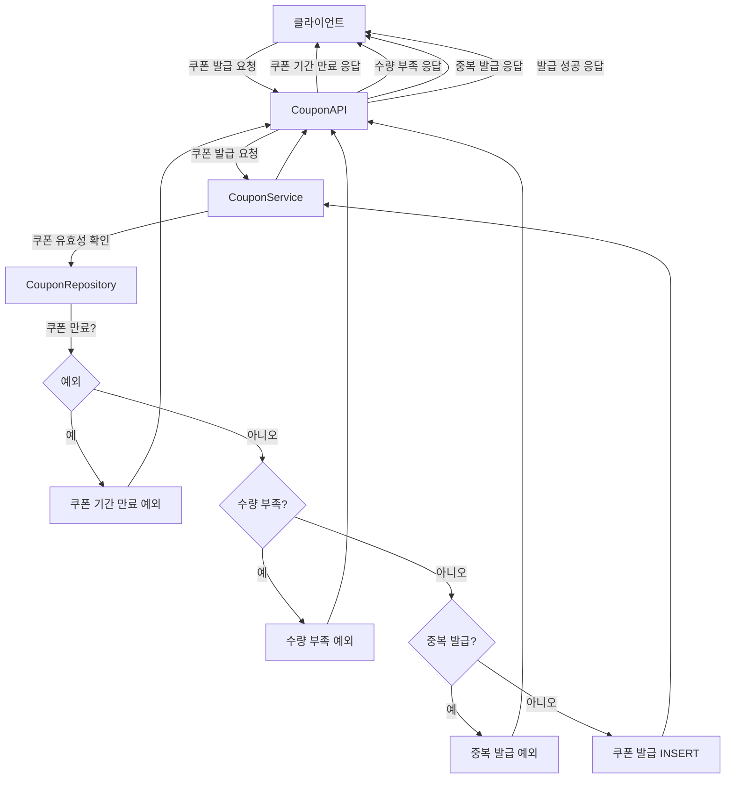
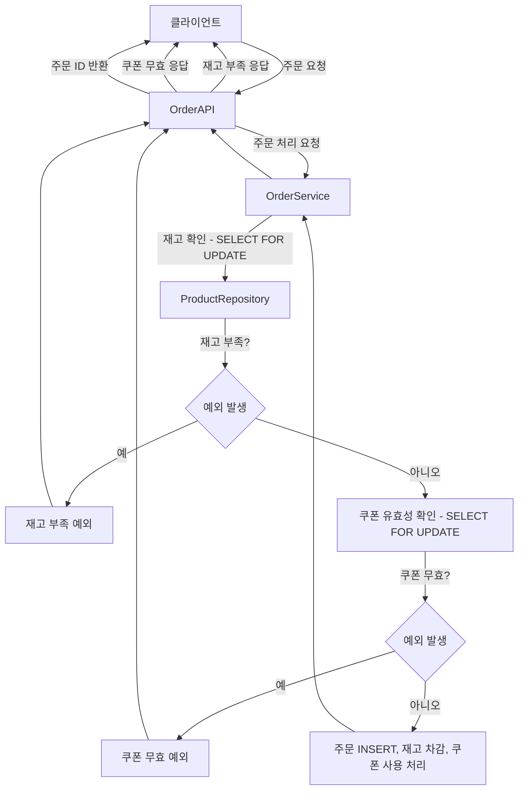
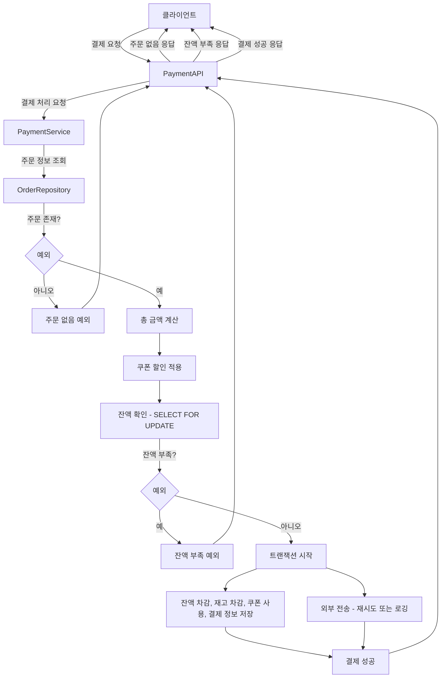
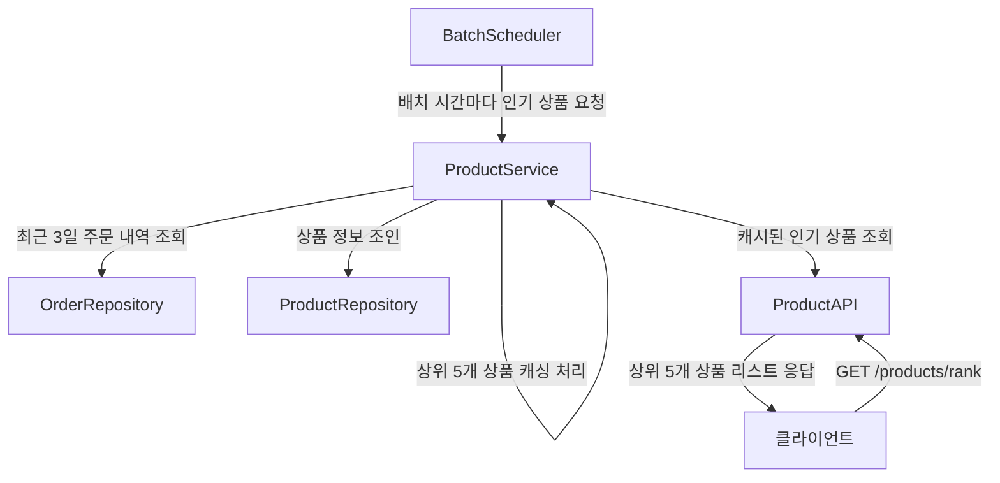

# 목차

- [상품 조회 API Flowchart](#상품-조회-api-flowchart)
- [잔액 조회 API Flowchart](#잔액-조회-api-flowchart)
- [잔액 충전 API Flowchart](#잔액-충전-api-flowchart)
- [선착순 쿠폰 발급 API Flowchart](#선착순-쿠폰-발급-api-flowchart)
- [주문 API Flowchart](#주문-api-flowchart)
- [결제 API Flowchart](#결제-api-flowchart)
- [인기 상품 조회 API (배치 기반) Flowchart](#인기-상품-조회-api-배치기반-flowchart)

### 상품 조회 API Flowchart
   mermaid

### 잔액 조회 API Flowchart

### 잔액 충전 API Flowchart

### 선착순 쿠폰 발급 API Flowchart

### 주문 API Flowchart

### 결제 API Flowchart

### 인기 상품 조회 API 배치기반 Flowchart

