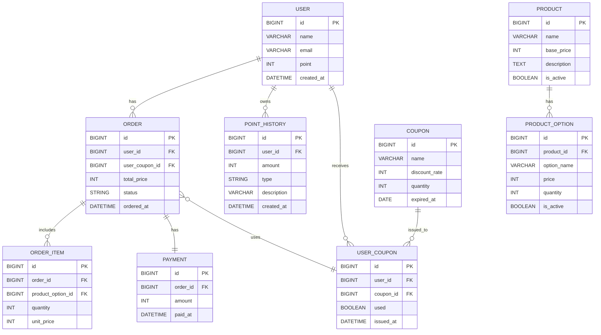

### 관계 표현
| 관계 표현   | 관계 형태    | 설명 (관계의 의미)                 |
|-------------|--------------|----------------------------------|
| has         | 1:N 또는 1:1 | ~을 가진다 (소유 또는 포함 의미)   |
| owns        | 1:N          | ~을 소유한다 (소유권 또는 관리 의미)|
| receives    | 1:N          | ~을 받는다 (수신, 지급받음 의미)   |
| includes    | 1:N          | ~을 포함한다 (포함 관계)           |
| uses        | 0..1:1       | ~을 사용한다 (선택적 사용)         |
| issued_to   | 1:N          | ~에게 발급된다 (발급 대상 관계)     |

### 인기 상품 데이터는 redis에 저장하여 관리한다.